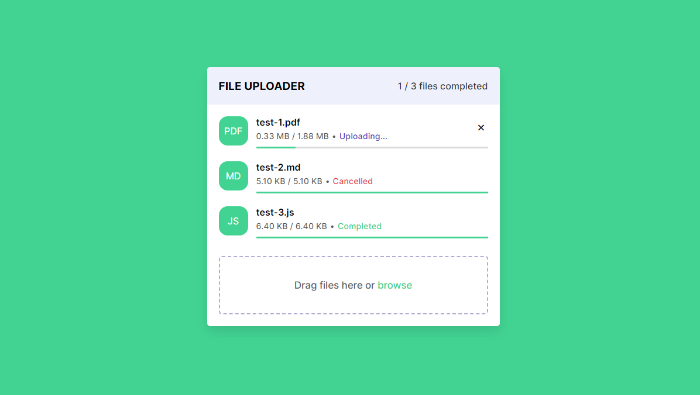

# Modern File Uploader

A modern file uploader built with HTML, CSS, JavaScript, and PHP. This project allows users to upload files via drag-and-drop or file selection, displaying upload progress and status for each file.

## Table of Contents

- [Demo](#demo)
- [Features](#features)
- [Technologies](#technologies)
- [Setup](#setup)
- [Usage](#usage)
- [License](#license)
- [Author](#author)

## Demo



## Features

- Drag-and-drop file uploading
- File selection via file input
- Real-time upload progress and status
- Cancel upload functionality
- Responsive and accessible design

## Technologies

- HTML5
- CSS3
- JavaScript (ES6+)
- PHP

## Setup

To run this project locally, follow these steps:

1. **Clone the repository:**

   ```bash
   git clone https://github.com/yourusername/modern-file-uploader.git
   cd modern-file-uploader
   ```

2. **Install XAMPP or a similar environment:**
   Ensure you have XAMPP installed, which provides an Apache web server with PHP support. You can download XAMPP from [https://www.apachefriends.org/index.html](https://www.apachefriends.org/index.html).

3. **Set up the project in XAMPP:**

   - Navigate to your XAMPP installation directory and find the `htdocs` folder (e.g., `C:\xampp\htdocs` on Windows.
   - Copy the `modern-file-uploader` folder from step 1 into the `htdocs` directory.

4. **Start Apache server:**

   - Open XAMPP control panel and start the Apache server.

5. **Access the project:**
   - Open your web browser and navigate to `http://localhost/modern-file-uploader` to view the file uploader application.

## Usage

1. Open the file uploader in your browser.
2. Drag and drop files into the upload box or click the browse button to select files.
3. Monitor the upload progress and status for each file.
4. Cancel uploads if needed.

## Project Structure

```plaintext
modern-file-uploader/
├── uploads/              # Folder where uploaded files are stored
├── index.html            # Main HTML file
├── style.css             # CSS styles
├── script.js             # JavaScript code
└── api.php               # PHP backend script

```
